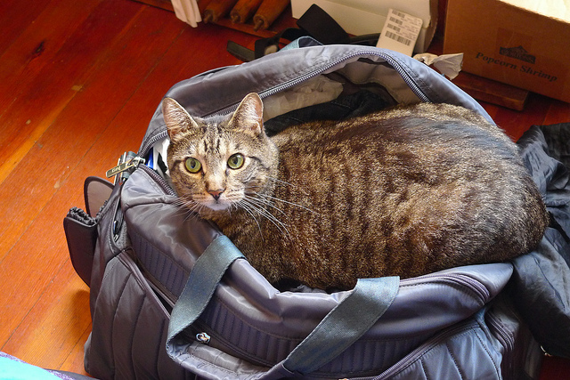

# Image Captioning with Convolutional Neural Networks trained on MSCOCO and STAIR Captions (Japanese)

This is an implementation of Show and Tell: A Neural Image Caption Generator (https://arxiv.org/abs/1411.4555) a generative image captioning model using a neural network with convolutional and recurrent layers.
The model can be trained on [MSCOCO](http://cocodataset.org/#home) and [STAIR Captions](http://captions.stair.center) that Japanese captions are annotated to MSCOCO images.
Given an image, this model generates a sentence that describes it.

Most of the codes included in this repository are copied or recreated from chainer examples `https://github.com/chainer/chainer/tree/master/examples/image_captioning`.

**NOTE: The hyperparameters of NIC model and the provided pretrained models may NOT be optimal. So, please re-train the model when you want to use the codes in this repository as a baseline model in your scientific experiments.**

## Requirements

This example requires the following packages.

- Chainer >=4.0
- Cupy >=4.0 (if you use GPU)
- PIL
- pycocotools

Pycocotools that an encoding issue of json loading is fixed is enclosed as submodule in this repository.
To install pycocotools, run `pip install -e .` from `cocoapi/PythonAPI` where `setup.py` is located.

## Model Overview

The model takes an image as input which is fed through a pretrained VGG16 model in order to extract features.
These features are then passed to a language model, a recurrent neural network that generates a caption word-by-word until the `EOS` (end-of-sentence) token is encountered or the caption reaches a maximum length.
During training, the loss is the softmax cross entropy of predicting the next word given the preceding words in the caption.

### More About the Language Model

The internals of the language models is a neural network with [LSTM](https://docs.chainer.org/en/stable/reference/generated/chainer.links.LSTM.html) layers.
However, Chainer also has a [NStepLSTM](https://docs.chainer.org/en/stable/reference/generated/chainer.links.NStepLSTM.html) layer which does not require sequential passes (for-loops in the code) which is faster. Using the latter, you do not have to align the caption lengths in the training data neither, which you usually do if using the former.
This example uses NStepLSTM by default, but also includes the equivalent code implmenented using standard LSTM as a reference.
When training with LSTM, you may want to specify the maximum caption length `--max-caption-length` to which all captions will be capped.

## Dataset

Run the following command to download the MSCOCO captioning dataset and the STAIR Captions for training this model.

```bash
$ python download.py
```

This downloads and extracts the training and validation images, as well as necessary meta data including captions to a `data` directory under the current folder.
You can change the output directory by appeding `--out` followed by the target directory.
Notice that this may take a while and that it requires approximately 20 GB of disk space.

## Training

Once `download.py` finishes, you can start training the model.

```bash
$ python train.py --rnn nsteplstm --snapshot-iter 1000 --max-iters 50000 --batch-size 128 --gpu 0 --dataset-name mscoco
```
You can also train the model using the STAIR Captions by setting `--dataset-name stair_captions`.

If you run this script on Linux, setting the environmental variable `MPLBACKEND` to `Agg` may be required to use `matplotlib`. For example,

```
MPLBACKEND=Agg python train.py ...
```

The above example starts the training with the NStepLSTM layers in the language model and saves a snapshot of the trained model every 1000 iteration.
By default, the first model snapshot is saved as `result/model_1000`.

If you have specified a download directory for MSCOCO when preparing the dataset, add the `--mscoco-root` option followed by the path to that directory.

## Testing

To generate captions for new images, you need to have a snapshot of a trained model.
Assuming we are using the model snapshots from the training example after 20000 iterations, we can generate new captions as follows.

```bash
$ python predict.py --img cat.jpg --model result/model_20000 --rnn nsteplstm --max-caption-length 30 --gpu 0 --dataset-name mscoco --out prediction.json
```

It will print out the generated captions to std out.
A json file of a dictionary with an image path as key and a predicted caption as value is saved to `--out`.
If you want to generate captions to all images in a directory, replace `--img` with `--img-dir` followed by the directory.
Note that `--rnn` and `--dataset-name` need to given the correct value corresponding to the model.

## Pretrained Models

I provided the models trained on the MSCOCO and the STAIR Captions.
You can download them placed on Google drive from the following links.

| Iteration 	| MSCOCO (en) 	| STAIR Captions (ja) 	|
|----------:	|:-----------:	|:-------------------:	|
| 10000     	| [Modelfile](https://drive.google.com/file/d/12CDdEMV7m0NDNIB3KSzfM-GoxLQ_eoC5/view?usp=sharing)            	| [Modelfile](https://drive.google.com/open?id=12d7m-JcTQOnvPN-L6Mk15qbtnlypGsfK)                    	|
| 20000     	| [Modelfile](https://drive.google.com/file/d/12F4CEpEUlOsdWDF68g_vXB9X_TK0-kFy/view?usp=sharing)            	| [Modelfile](https://drive.google.com/open?id=12dgAzD0KQLZGQH7K9wHSuG_uT3f5_KDm)                    	|
| 30000     	| [Modelfile](https://drive.google.com/file/d/12HEz0G-T8rmUK6yUb7aZPxS8DPr9l4Yp/view?usp=sharing)            	| [Modelfile](https://drive.google.com/open?id=12f6pUos8S4YSqP0sBiTDmnhNlhLytKCT)                    	|
| 40000     	| [Modelfile](https://drive.google.com/file/d/12JFKVhrBmTNVOXTCgrhDNHt_sqolTxbb/view?usp=sharing)            	| [Modelfile](https://drive.google.com/open?id=12iSmXzVbrhNegmhteEeI4XN2LZ27ELeJ)                    	|
| 50000     	| [Modelfile](https://drive.google.com/file/d/12OuDuiNkJ_sAhEy2MI7bLW8vLK_9kXyS/view?usp=sharing)            	| [Modelfile](https://drive.google.com/open?id=12iWdRTHwH0AndA4Ky97ftz1G6d8AuAyk)                    	|

## Examples Using Pretrained Models

For some images on the MSCOCO validation set, I generated captions using the pretrained models (Iteration 50000) of MSCOCO and STAIR Captions.


| Image | MSCOCO (en) | STAIR Captions (ja) |
|-------|-------------|---------------------|
|  | a cat laying on a bed with a book . | 黒い 猫 が スーツケース の 中 に 入っ て いる |
|  | a parking meter sitting on the side of a road . | パーキングメーター の 前 に 車 が 停 まっ て いる |
